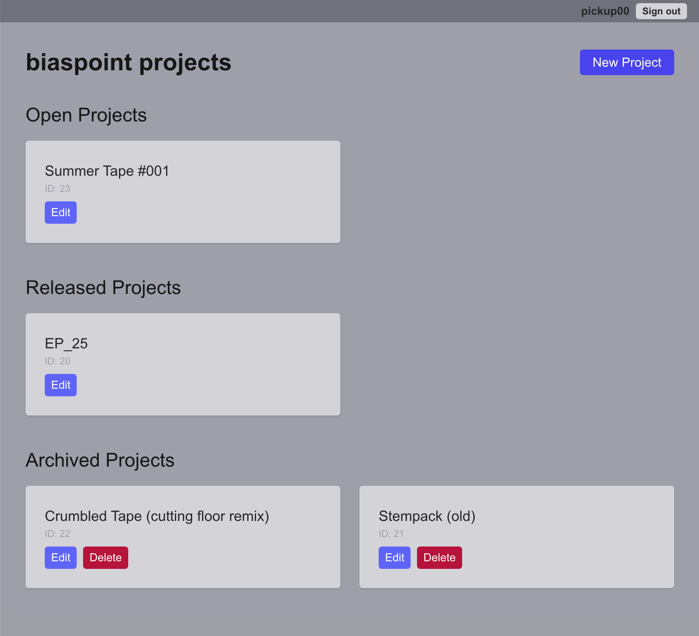
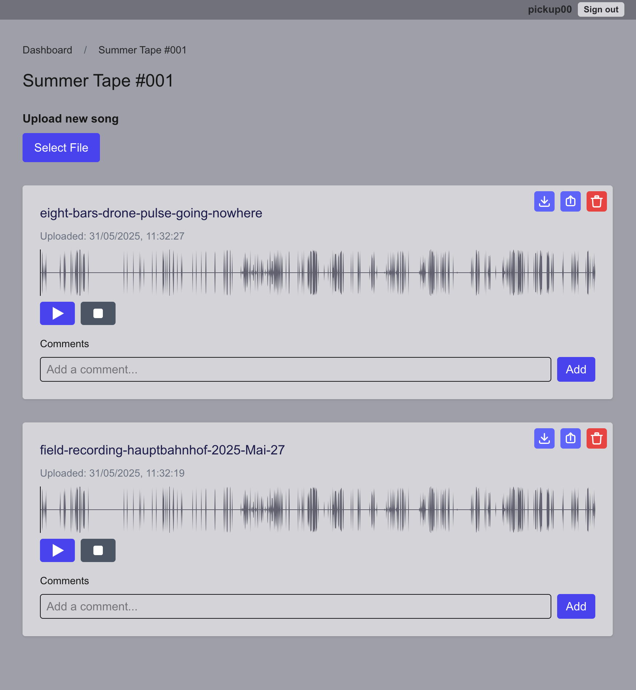
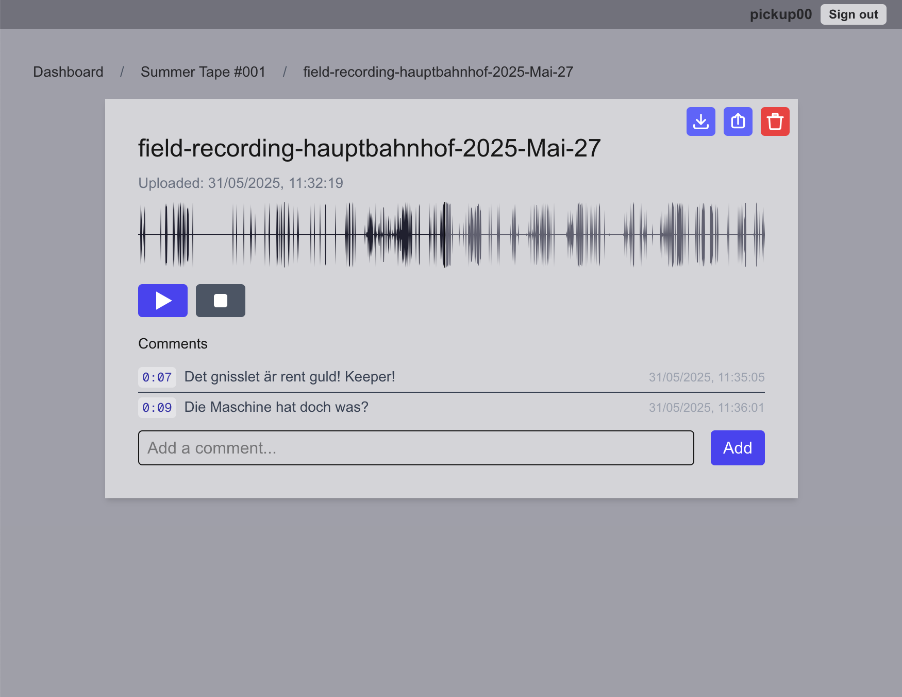

# Band Bridge

A web app for band collaboration: create projects, upload media (audio, video, and images), and comment on media with time-based markers. Built with Next.js, React, TypeScript, Tailwind CSS, and Postgres (via Prisma). Media files are managed by a dedicated microservice with waveform pre-computation. User, band, and API key management is handled by a secure admin microservice.

<picture>
   
</picture>

<picture>
   
</picture>

<picture>
   
</picture>

---

## Features

- Band/project management with multiple members
- Media upload (audio MP3/WAV, video MP4/MOV/AVI/H.264, images JPG/PNG), download, and deletion
- Precomputed waveform rendering for instant audio visualization using BBC audiowaveform
- Time-based comments on audio/video with precise timeCode positioning
- Image galleries with project-level comments (not time-based)
- Individual images display as single media items with per-media comments
- Multiple images display as unified "Project images" gallery with shared comments
- Deep links to media details with shareable URLs
- Responsive, modern UI built with Next.js 15, React 19, and Tailwind CSS 4
- Session-based authentication with secure middleware protection
- Rich text editor for descriptions using Jodit React
- Audio waveform visualization using WaveSurfer.js
- Video playback with HTML5 video controls
- Comprehensive test suite: Jest (API/UI), Playwright (E2E)
- Admin microservice for user, band, and API key management (REST API only, no UI)

---

## System Requirements
- [Docker](https://www.docker.com/) and [Docker Compose](https://docs.docker.com/compose/) (v2.0+)
- Node.js 18+ (for local development)
- npm 8+ (for local development)

---

## Installation & Setup

### Quick Start (Production Deployment)

1. **Clone the repository:**
   ```sh
   git clone https://github.com/aweijnitz/band-bridge.git
   cd band-bridge
   ```

2. **Set up environment variables:**
   ```sh
   cp .env.example .env
   cp src/backend/admin/.env.example src/backend/admin/.env
   ```
   
   Edit `.env` and set these required variables:
   ```env
   DATABASE_URL=postgresql://postgres:YOUR_DB_PASSWORD@db:5432/bandbridge
   POSTGRES_PASSWORD=YOUR_SECURE_DB_PASSWORD
   ADMIN_API_KEY=YOUR_SECURE_ADMIN_API_KEY
   MEDIA_SERVICE_URL=http://media:4001
   MAX_UPLOAD_SIZE=1GB
   NEXTAUTH_SECRET=YOUR_NEXTAUTH_SECRET_KEY
   NEXTAUTH_URL=http://localhost:3000
   JWT_SECRET=YOUR_JWT_SECRET
   ```

   Edit `src/backend/admin/.env` with the same database settings:
   ```env
   DATABASE_URL=postgresql://postgres:YOUR_DB_PASSWORD@db:5432/bandbridge
   ADMIN_API_KEY=YOUR_SECURE_ADMIN_API_KEY
   ```

3. **Build and start all services:**
   ```sh
   # Build Docker images
   ./buildDockerImages.sh
   
   # Start all services
   docker compose up -d
   ```
   
   This starts:
   - **Web app** (port 3000) - Next.js frontend and API
   - **Database** (internal) - PostgreSQL with persistent storage
   - **Media service** (internal) - Express server with audiowaveform and ffmpeg
   - **Admin service** (port 4002) - Express server for user/band management

4. **Verify deployment:**
   ```sh
   # Check all services are running
   docker compose ps
   
   # Check application health
   curl http://localhost:3000/api/health
   curl http://localhost:4002/health
   ```

**How to stop all services:**
   ```sh
   docker compose down
   ```

### Database Migrations

#### Initial Setup (First Time)
The database schema is automatically created when the services start for the first time.

#### Upgrading to New Version
When deploying a new version with database changes, run migrations:

```sh
# For running system (recommended)
docker compose exec admin npx prisma migrate deploy

# Alternative: Stop system, migrate, then restart
docker compose down
docker compose up -d db
docker compose exec db psql -U postgres -d bandbridge -c "SELECT 1;" # Wait for DB ready
docker compose up -d admin
docker compose exec admin npx prisma migrate deploy
docker compose up -d
```

#### Manual Database Operations

**Connect to database:**
```sh
docker compose exec db psql -U postgres -d bandbridge
```

**Reset database (⚠️ DESTRUCTIVE):**
```sh
# This will delete ALL data
docker compose exec admin npx prisma migrate reset --force
```

**Change database password:**
```sh
# 1. Connect to database
docker compose exec db psql -U postgres
ALTER USER postgres WITH PASSWORD 'your_new_password';
\q

# 2. Update environment variables in .env and src/backend/admin/.env
# 3. Restart services
docker compose down && docker compose up -d
```

### Local Development Setup

For development with hot-reload and faster iteration:

1. **Install dependencies:**
   ```sh
   npm install
   ```

2. **Start database and services:**
   ```sh
   # Start only database and supporting services
   docker compose up -d db media admin
   ```

3. **Set up local environment:**
   ```sh
   cp .env.example .env
   # Edit .env with local settings (DATABASE_URL should point to localhost:5432)
   ```

4. **Run database migrations:**
   ```sh
   npm run generate:schema
   ```

5. **Start development server:**
   ```sh
   npm run dev
   ```
   
   The app will be available at http://localhost:3000 with hot-reload enabled.

6. **Run tests:**
   ```sh
   npm run test          # API and UI tests
   npm run test:e2e      # End-to-end tests
   npm run lint          # Code linting
   ```

---

## Project Architecture

```
band-bridge/
├── src/
│   ├── app/                # Next.js frontend & API routes
│   │   ├── api/            # API endpoints
│   │   │   ├── auth/       # Authentication routes
│   │   │   ├── project/    # Project CRUD and media/song management
│   │   │   ├── health/     # Health check endpoint
│   │   │   └── mine/       # User's own projects
│   │   ├── components/     # Reusable UI components
│   │   ├── dashboard/      # Dashboard UI
│   │   └── project/        # Project detail pages
│   ├── backend/
│   │   ├── media/          # Media microservice (Express, waveform pre-compute)
│   │   └── admin/          # Admin microservice (Express, Prisma)
│   ├── generated/          # Generated Prisma client
│   └── lib/                # Utility libraries
├── public/
│   └── (static assets only)
├── prisma/                 # Prisma schema and migrations (in admin service)
├── tests/                  # API and UI tests
├── docker-compose.yml      # Multi-service orchestration
└── README.md
```

**Media Microservice:**
  - Located at `src/backend/media/`
  - Handles media file uploads, deletions, and waveform pre-computation using [BBC audiowaveform](https://github.com/bbc/audiowaveform).
  - All media and waveform files are stored in a Docker volume mounted at `/assetfilestore` inside the media microservice container. This volume is not directly accessible from the host or the Next.js app.
  - Waveform data is saved as `.dat` files next to the media files (e.g., `media.wav` → `media.wav.dat`).

- **Admin Microservice:**
  - Located at `src/backend/admin/`
  - Handles user, band, and API key management (admin-only, static API key required).
  - All endpoints require `Authorization: Bearer <ADMIN_API_KEY>` header.

---

## UI/UX

- Download, delete, and share buttons are consistently placed at the top right of each media card and the media details page.
- Sharing a media copies a deep link to the clipboard and shows a toast notification.
- All file and waveform requests are proxied through the Next.js API for security and abstraction.


---

## Deep Linking & Sharing

Every media item has a unique URL (`/project/[projectId]/media/[mediaId]`). Songs also have their own URLs (`/project/[projectId]/song/[songId]`). Use the share button to copy a direct link to the clipboard.

---

## Media Microservice API

### Health Check
```sh
curl http://localhost:4001/health
```

### Upload Media File
```sh
curl -F "file=@/path/to/file.mp4" http://localhost:4001/upload
```
- Response: `{ "fileName": "<timestamp>_file.wav" }`
- Also creates `<timestamp>_file.wav.dat` in the filestore.

### Delete Media File
```sh
curl -X DELETE http://localhost:4001/delete-media \
  -H "Content-Type: application/json" \
  -d '{"fileName":"<timestamp>_file.mp4"}'
```
- Deletes both the audio file and its `.dat` waveform file.

### Download Audio or Waveform File
```sh
curl http://localhost:4001/files/<fileName>
curl http://localhost:4001/files/<fileName>.dat
```

### Reset All Media Files
**⚠️ WARNING: This will permanently delete ALL stored media files and waveform data!**

```sh
curl -X POST http://localhost:4001/reset \
  -H "Authorization: Bearer <ADMIN_API_KEY>"
```
- Requires admin API key authorization
- Deletes all files in the filestore directory
- Returns success status and count of deleted files
- This endpoint is typically called by the admin service reset endpoint

---

## Admin Microservice API

All endpoints require the `Authorization: Bearer <ADMIN_API_KEY>` header.

### Health Check
```sh
curl http://localhost:4002/health
```

### Create User
```sh
curl -X POST http://localhost:4002/admin/users \
  -H "Authorization: Bearer <ADMIN_API_KEY>" \
  -H "Content-Type: application/json" \
  -d '{"username":"alice","password":"supersecret123"}'
```

### Create Band
```sh
curl -X POST http://localhost:4002/admin/bands \
  -H "Authorization: Bearer <ADMIN_API_KEY>" \
  -H "Content-Type: application/json" \
  -d '{"name":"The Rockers"}'
```

### Assign User to Band
```sh
curl -X POST http://localhost:4002/admin/bands/1/users \
  -H "Authorization: Bearer <ADMIN_API_KEY>" \
  -H "Content-Type: application/json" \
  -d '{"userId":2}'
```

### Create API Key for User
```sh
curl -X POST http://localhost:4002/admin/users/2/apikeys \
  -H "Authorization: Bearer <ADMIN_API_KEY>"
```
- Response: `{ "id": 1, "apiKey": "<PLAIN_API_KEY>" }` (shown only once)

### Revoke API Key
```sh
curl -X POST http://localhost:4002/admin/apikeys/1/revoke \
  -H "Authorization: Bearer <ADMIN_API_KEY>"
```

### Reset Complete Application State
**⚠️ WARNING: This will permanently delete ALL data including users, bands, projects, media, and comments!**

```sh
curl -X POST http://localhost:4002/admin/reset \
  -H "Authorization: Bearer <ADMIN_API_KEY>"
```
- Deletes all database records (users, bands, projects, media, comments, sessions, API keys)
- Calls the media service reset endpoint to delete all stored media files
- Returns success status and count of deleted media files

---

## Main API Service (Next.js)

### Projects

- **List Projects**
  ```sh
  curl http://localhost:3000/api/project
  ```
- **Get Project**
  ```sh
  curl http://localhost:3000/api/project/1
  ```
- **Create Project**
  ```sh
  curl -X POST http://localhost:3000/api/project \
    -H "Content-Type: application/json" \
    -d '{"name":"New Project","ownerId":1,"status":"open","bandId":1}'
  ```
- **Update Project**
  ```sh
  curl -X PUT http://localhost:3000/api/project/1 \
    -H "Content-Type: application/json" \
    -d '{"name":"Renamed Project","ownerId":1,"status":"released","bandId":1}'
  ```
- **Delete Project**
  ```sh
  curl -X DELETE http://localhost:3000/api/project/1
  ```

### Media

- **List Media in Project**
  ```sh
  curl http://localhost:3000/api/project/1/media
  ```
- **Get Media**
  ```sh
  curl http://localhost:3000/api/project/1/media/2
  ```
- **Upload Media (audio/video/image)**
  ```sh
  # Audio file
  curl -F "file=@/path/to/audio.mp3" -F "title=My Song" -F "description=<p>Rich text description</p>" http://localhost:3000/api/project/1/media
  
  # Video file  
  curl -F "file=@/path/to/video.mp4" -F "title=My Video" http://localhost:3000/api/project/1/media
  
  # Image file
  curl -F "file=@/path/to/image.jpg" -F "title=My Image" http://localhost:3000/api/project/1/media
  ```
  Note: Descriptions support rich HTML formatting.
  
- **Delete Media**
  ```sh
  curl -X DELETE http://localhost:3000/api/project/1/media/2
  ```

### Songs (Legacy Media API)

- **List Songs in Project**
  ```sh
  curl http://localhost:3000/api/project/1/song
  ```
- **Get Song**
  ```sh
  curl http://localhost:3000/api/project/1/song/2
  ```
- **Get Song Audio**
  ```sh
  curl http://localhost:3000/api/project/1/song/audio?fileName=<fileName>
  ```
- **Get Song Waveform**
  ```sh
  curl http://localhost:3000/api/project/1/song/waveform?fileName=<fileName>
  ```

### Comments

#### Media Comments (Time-based)
- **List Comments for Media**
  ```sh
  curl http://localhost:3000/api/project/1/media/2/comment
  ```
- **Add Comment (requires authentication)**
  ```sh
  curl -X POST http://localhost:3000/api/project/1/media/2/comment \
    -H "Content-Type: application/json" \
    -d '{"text":"Great comment!","time":42.5}'
  ```

#### Gallery Comments (Project-level)
- **List Gallery Comments**
  ```sh
  curl http://localhost:3000/api/project/1/gallery/comment
  ```
- **Add Gallery Comment (requires authentication)**
  ```sh
  curl -X POST http://localhost:3000/api/project/1/gallery/comment \
    -H "Content-Type: application/json" \
    -d '{"text":"Great gallery comment!"}'
  ```
  Note: Gallery comments are stored with `time: -1` as a special marker.

#### Legacy API
- **Comments for Songs (Legacy)**
  ```sh
  curl http://localhost:3000/api/project/1/song/2/comment
  ```

### Media File Proxy Endpoints

- **Download Media File**
  ```sh
  curl "http://localhost:3000/api/project/1/media/file?file=<fileName>&type=file"
  ```
- **Download Waveform Data**
  ```sh
  curl "http://localhost:3000/api/project/1/media/file?file=<fileName>&type=waveform"
  ```
- **Get Signed URL for Media**
  ```sh
  curl http://localhost:3000/api/project/1/media/2/signed-url
  ```
- Automatically sets proper MIME types based on file extension (video/mp4, audio/mpeg, etc.)
- Supports all media types: audio, video, and waveform data

---

## API Proxying

All media and waveform file requests from the frontend are proxied through the Next.js API, which streams data from the media microservice. The frontend does not access the file storage directly.

---

## Environment Variables

### Required Variables
- `DATABASE_URL`: PostgreSQL connection string for all services (e.g., `postgresql://postgres:password@db:5432/bandbridge`)
- `POSTGRES_PASSWORD`: Database password (must match DATABASE_URL)
- `ADMIN_API_KEY`: Static API key for admin microservice authentication
- `MEDIA_SERVICE_URL`: Internal URL for media microservice (default: `http://media:4001`)
- `NEXTAUTH_SECRET`: Secret key for NextAuth.js session encryption
- `JWT_SECRET`: Secret key for JWT token generation

### Optional Variables
- `NEXT_PUBLIC_BAND_NAME`: Band name displayed in the UI (default: "Band Bridge")
- `MAX_UPLOAD_SIZE`: Maximum file upload size (default: `1GB`, accepts `500MB`, `0.5GB`, etc.)
- `NEXTAUTH_URL`: Base URL for NextAuth.js (default: `http://localhost:3000`)
- `AUDIO_LINK_EXPIRY_DAYS`: Days before audio links expire (default: 100)

### Internal/Auto-configured
- `MEDIA_SERVICE_PORT`: Media microservice port (4001, internal only)
- `NODE_ENV`: Runtime environment (set by Docker Compose)

---

## Notes

### Media Handling
- **Waveform Pre-Compute:** On upload, the media microservice runs BBC `audiowaveform` to generate a `.dat` file for fast waveform rendering in the UI.
- **File Storage:** All media and waveform files are stored in a Docker volume at `/assetfilestore` inside the media microservice. They are not accessible from the Next.js app or the host filesystem.
- **Image Galleries:** 
  - Single images display as individual media items with per-media comments
  - Multiple images display as "Project images" gallery with project-level comments
  - Gallery comments use `time: -1` as a special marker to distinguish from time-based media comments

### Authentication & Security
- **Session-based Authentication:** Uses secure HTTP-only cookies with database-stored sessions
- **Protected Routes:** Middleware protects all routes except login and public deep-links
- **File Proxying:** All file access goes through Next.js API for security and abstraction
- **Rich Text Sanitization:** All HTML content is sanitized using DOMPurify

### Technology Stack
- **Frontend:** Next.js 15.3.2 with React 19.0.0 and Tailwind CSS 4
- **Backend:** Express.js microservices with TypeScript
- **Database:** PostgreSQL 15 with Prisma ORM
- **Media Processing:** BBC audiowaveform, FFmpeg
- **Testing:** Jest (API/UI), Playwright (E2E), React Testing Library
- **Development:** Hot-reload with Turbopack, ESLint for code quality

### Testing
- **Unit Tests:** `npm test` - Jest-based API and UI tests
- **E2E Tests:** `npm run test:e2e` - Playwright end-to-end test suite
- **Coverage:** `npm run test:coverage` - Generate test coverage reports
- **Linting:** `npm run lint` - ESLint code quality checks

---

## AI Transparency

This project was created with heavy support by AI agentic code generation workflows, using [Cursor](https://www.cursor.com/). It is amazing what one can achieve, but also amazing what such an advanced tool overlooks. 

Further feature development was done with OpenAI Codex (very competent and interesting interaction model!) and Anthropic Claude (amazing, but expensive as you run out of tokens quickly at the €17/month tier).

---

## License
MIT
