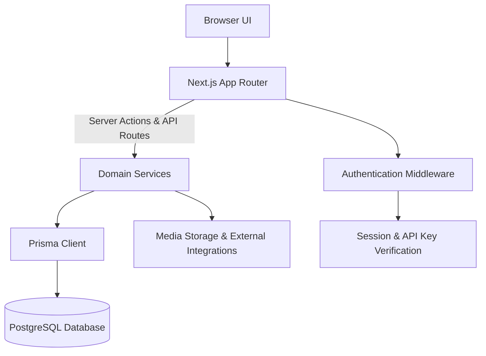
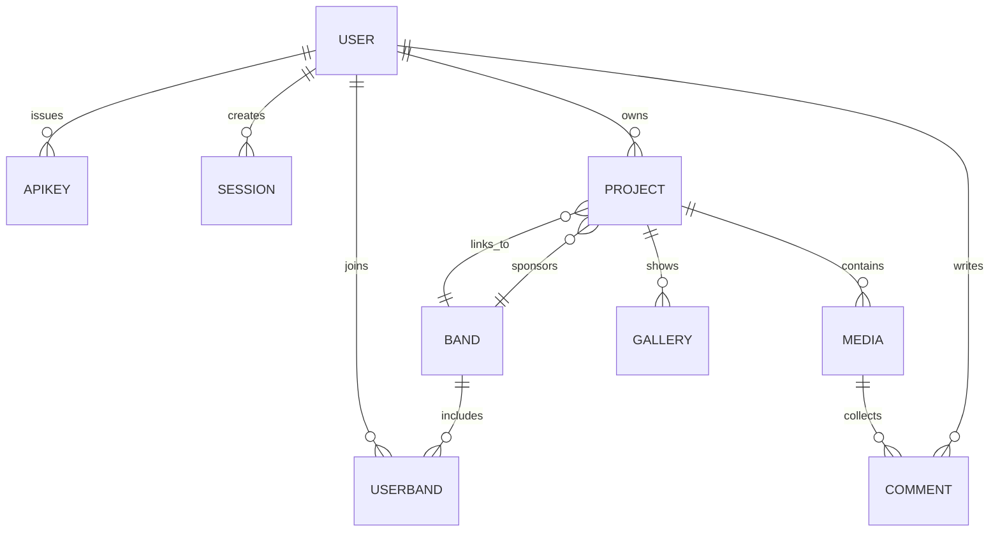

# Architecture

## Overview
Band Bridge is implemented as a Next.js application using the App Router. React components render the UI, while server actions and API routes in the same project coordinate data access. Domain-oriented service modules encapsulate business rules and wrap the Prisma client, which persists data in a PostgreSQL database. Authentication helpers ensure only authorized users can read or modify resources.

## System Flow

## Data Model
The Prisma schema defines Users who own projects and join bands, with many-to-many membership handled through the `UserBand` join table. Projects can optionally be associated with a band and collect media assets and galleries. Media items accept user comments, and user sessions plus API keys control authenticated access.

